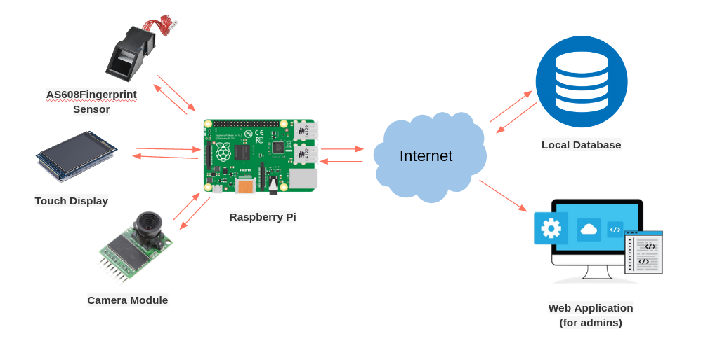
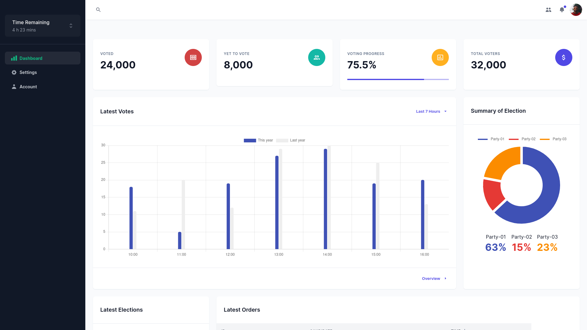
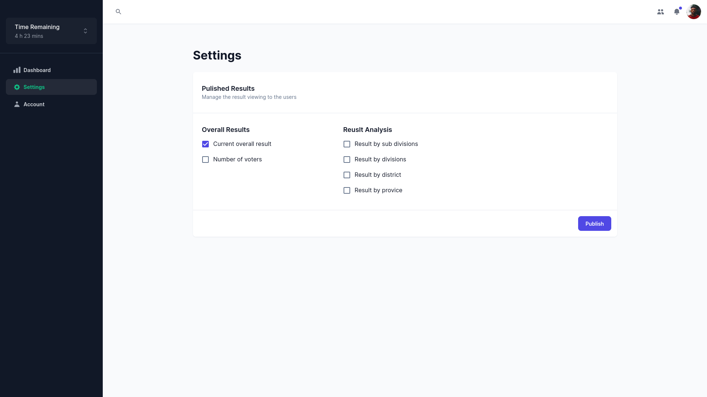
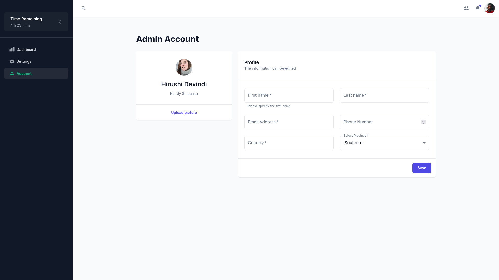
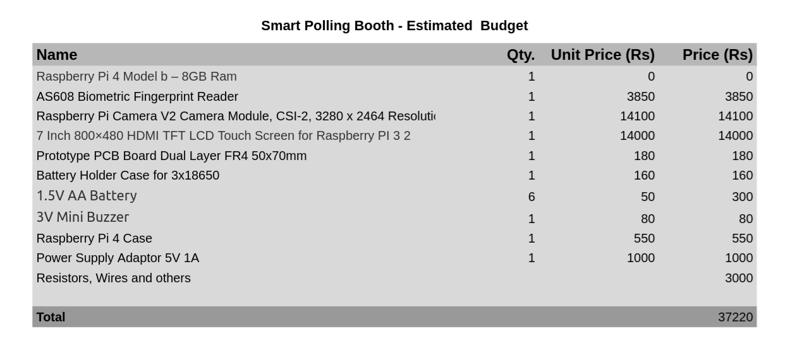

[comment]: # "This is the standard layout for the project, but you can clean this and use your own template"

# Smart Polling Booth

---

## Team
-  E/18/073, Dhananjaya W. M. T., [email](mailto:e18073@eng.pdn.ac.lk)
-  E/18/214, Manahara H. K., [email](mailto:e18214@eng.pdn.ac.lk)
-  E/18/323, Seekkubadu H.D., [email](mailto:e18323@eng.pdn.ac.lk)

<!-- Image (photo/drawing of the final hardware) should be here -->

<!-- This is a sample image, to show how to add images to your page. To learn more options, please refer [this](https://projects.ce.pdn.ac.lk/docs/faq/how-to-add-an-image/) -->

[Sample Image](./images/sample.png)

#### Table of Contents
1. [Introduction](#introduction)
2. [Solution Architecture](#solution-architecture )
3. [Hardware & Software Designs](#hardware-and-software-designs)
4. [Testing](#testing)
5. [Detailed budget](#detailed-budget)
6. [Conclusion](#conclusion)
7. [Links](#links)

## Introduction

https://user-images.githubusercontent.com/73760543/204222648-f0345018-dda2-4d9e-b89a-dd5fc52840d4.mp4

### Difficulties Around Current Voting Process
- Difficult  to eliminate Invalid votes 
- Not having proper ways to identify and verify  the voters to avoid cheating 
- No Efficient way to get time-to-time analysing process
- Manual voting systems need high cost for labourers, papers

## Suggested solution is a SMART POLLING BOOTH with
- Use both fingerprints and face recognition to verify the identity of the voters.
- Facilitating to monitor the voting process time-to-time.
- Facilitating to analyze the votings.
- Reducing the cost going for papers, labourers.

## Solution Architecture

&emsp;

## Hardware and Software Designs

<!--### Hardware Design-->

<!--&emsp; -->

### UI Design

#### Dashboard
&emsp;

#### Settings
&emsp;

#### Account
&emsp;

<!-- ## Testing

Testing done on hardware and software, detailed + summarized results -->

## Detailed budget

All items and costs

&emsp;
<!-- ## Conclusion What was achieved, future developments, commercialization plans-->
## Links

- [Project Repository](https://github.com/cepdnaclk/{{ page.repository-name }}){:target="_blank"}
- [Project Page](https://cepdnaclk.github.io/{{ page.repository-name}}){:target="_blank"}
- [Department of Computer Engineering](http://www.ce.pdn.ac.lk/)
- [University of Peradeniya](https://eng.pdn.ac.lk/)

[//]: # (Please refer this to learn more about Markdown syntax)
[//]: # (https://github.com/adam-p/markdown-here/wiki/Markdown-Cheatsheet)
